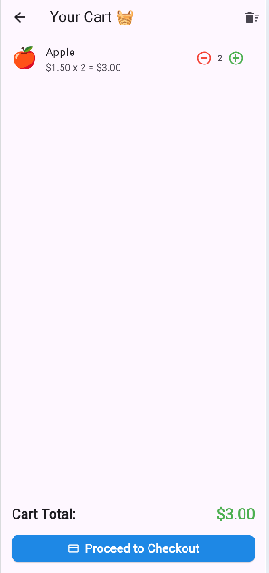
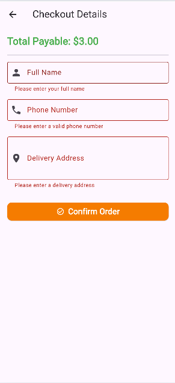
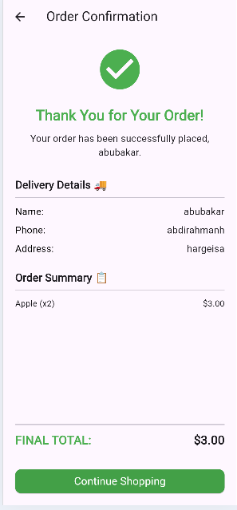

# 🛒 Hami MiniMarket (Week 2 Flutter Project)

## 📖 Project Description
Hami MiniMarket is a Flutter app built for my HamiSkills internship.  
It’s a simple mobile app prototype introducing the community store for fresh fruits and vegetables.


### Updates 
user can add and remove the items in the cart 
the user now can able to to provide delivery infotmation 
also the use can place the order seccessfully.
---

## 🖼️ Screenshots

###  Splash Screen


## 🏠 Home Screen


### ℹ️ Product List Screen


### 🥕 Products Details Screen


### Cart Screen 


### CartScreen with remove and add buttons 



### Form Validatiobs



### Order Summary 



---

## 🚀 How to Run
1. Clone the repository:
   ```bash
   git clone https://github.com/Abubakrde/flutter_intership_hami_mini_market.git


## Author 
Abubakar Abdirahman

