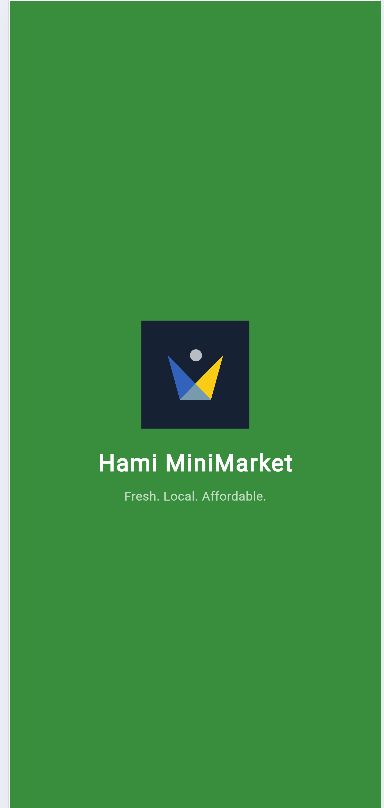
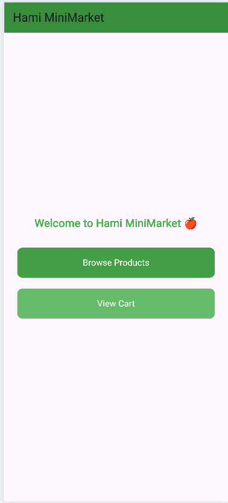
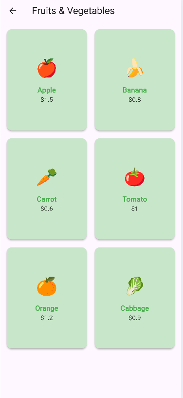
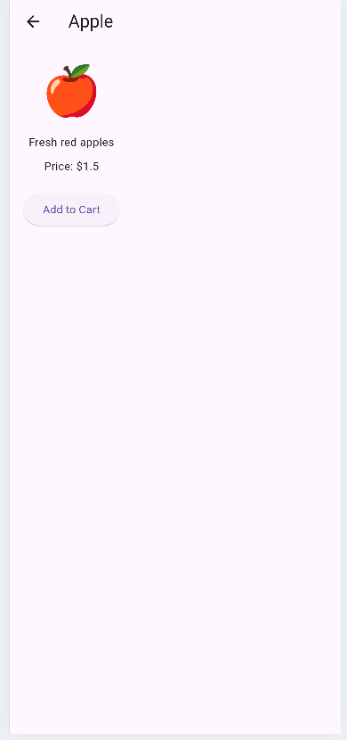
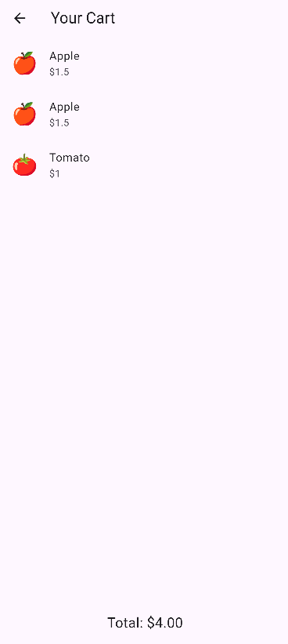

# 🛒 Hami MiniMarket (Week 1 Flutter Project)

## 📖 Project Description
Hami MiniMarket is a Flutter app built for my HamiSkills internship.  
It’s a simple mobile app prototype introducing the community store for fresh fruits and vegetables.

---

## 🖼️ Screenshots

###  Splash Screen


## 🏠 Home Screen


### ℹ️ Product List Screen


### 🥕 Products Details Screen


### Cart Screen 



---

## 🚀 How to Run
1. Clone the repository:
   ```bash
   git clone https://github.com/Abubakrde/flutter_intership_hami_mini_market.git
